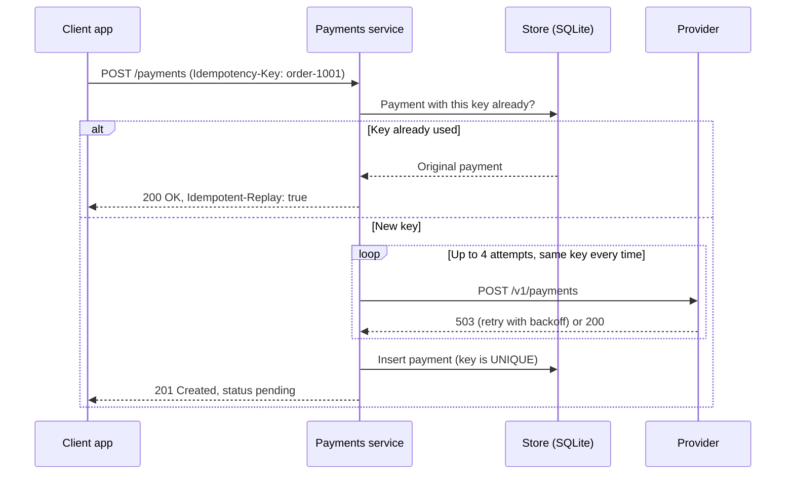
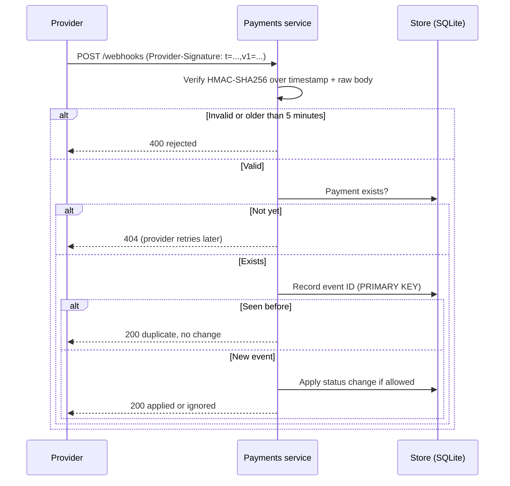
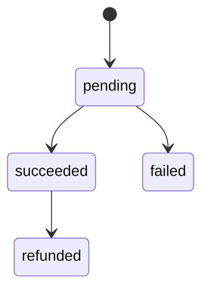

# Architecture

## Components

| Component | Role | Code |
|---|---|---|
| Client app | The prospect's app or backend; sends one request per order with an idempotency key | not included |
| Payments service | The integration: creates payments, receives and verifies webhooks | `payments_demo/app.py` |
| Provider client | Calls the provider with retries and backoff | `payments_demo/provider.py` |
| Store | SQLite; unique constraints enforce idempotency and event de-duplication | `payments_demo/store.py` |
| Signing | Webhook signature creation and verification | `payments_demo/signing.py` |
| Simulated provider | Local stand-in for a real provider, with failure injection | `payments_demo/mock_provider.py` |

## Creating a payment

## Receiving a webhook

## Payment status rules

Any other change, for example `succeeded` arriving after `refunded`, is ignored.

## What a production version would change

- PostgreSQL or another shared database instead of SQLite, so several service instances can run
- A queue between webhook receipt and processing, so slow processing never times out the provider
- Secrets from a secrets manager instead of environment variables
- Metrics and alerts on retry rates, rejected webhooks and payments stuck in `pending`
